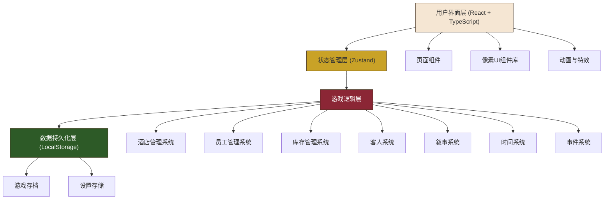
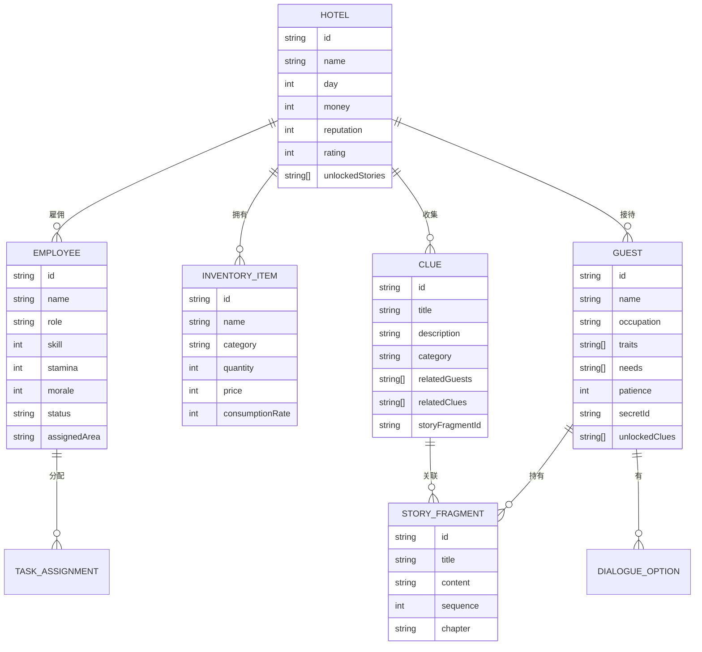

## 1. 架构设计



## 2. 技术栈描述

- **前端框架**：React@18 + TypeScript
- **构建工具**：Vite@5
- **样式方案**：TailwindCSS@3 + 自定义像素CSS
- **状态管理**：Zustand（轻量级，适合游戏状态管理）
- **路由管理**：React Router DOM@6
- **图标库**：Lucide React（与像素风格结合）
- **动画方案**：纯CSS动画 + Framer Motion（复杂动画）
- **数据持久化**：LocalStorage（游戏存档）
- **后端**：纯前端游戏，无需后端
- **数据**：Mock数据 + 程序化生成

## 3. 路由定义

| 路由 | 页面 | 用途 |
|------|------|------|
| `/` | 开始页面 | 游戏启动界面，新游戏/继续游戏 |
| `/hotel` | 酒店总览 | 酒店状态总览，资源面板 |
| `/management` | 日常管理 | 员工排班与任务分配 |
| `/inventory` | 库存管理 | 物资管理与采购 |
| `/guests` | 客人接待 | 客人列表与互动 |
| `/guest/:id` | 客人详情 | 特定客人互动与对话 |
| `/archive` | 故事档案 | 线索与故事收集 |
| `/dialogue` | 对话系统 | 全屏对话界面 |
| `/event` | 事件界面 | 特殊剧情事件 |
| `/settings` | 设置页面 | 游戏设置 |

## 4. 数据模型



## 5. 目录结构

```
src/
├── components/              # 通用UI组件
│   ├── pixel/              # 像素风格组件
│   │   ├── PixelButton.tsx
│   │   ├── PixelWindow.tsx
│   │   ├── PixelPanel.tsx
│   │   ├── PixelProgress.tsx
│   │   └── PixelAvatar.tsx
│   ├── layout/             # 布局组件
│   │   ├── GameContainer.tsx
│   │   ├── Header.tsx
│   │   └── Sidebar.tsx
│   └── game/               # 游戏特定组件
│       ├── ResourceBar.tsx
│       ├── HotelStatus.tsx
│       ├── EmployeeCard.tsx
│       ├── GuestCard.tsx
│       ├── InventorySlot.tsx
│       ├── ClueCard.tsx
│       └── DialogueBox.tsx
├── pages/                  # 页面组件
│   ├── StartPage.tsx
│   ├── HotelOverview.tsx
│   ├── ManagementPage.tsx
│   ├── InventoryPage.tsx
│   ├── GuestsPage.tsx
│   ├── GuestDetailPage.tsx
│   ├── ArchivePage.tsx
│   ├── DialoguePage.tsx
│   ├── EventPage.tsx
│   └── SettingsPage.tsx
├── store/                  # 状态管理
│   ├── useGameStore.ts     # 主游戏状态
│   ├── useHotelStore.ts    # 酒店状态
│   ├── useEmployeeStore.ts # 员工状态
│   ├── useInventoryStore.ts# 库存状态
│   ├── useGuestStore.ts    # 客人状态
│   └── useStoryStore.ts    # 故事状态
├── data/                   # 游戏数据
│   ├── employees.ts        # 员工数据
│   ├── items.ts            # 物品数据
│   ├── guests.ts           # 客人数据
│   ├── stories.ts          # 故事数据
│   ├── events.ts           # 事件数据
│   └── hotel.ts            # 酒店初始数据
├── types/                  # TypeScript类型定义
│   ├── game.ts
│   ├── employee.ts
│   ├── inventory.ts
│   ├── guest.ts
│   └── story.ts
├── hooks/                  # 自定义Hooks
│   ├── useGameLoop.ts
│   ├── useDialogue.ts
│   ├── useDailyCycle.ts
│   └── useSaveSystem.ts
├── utils/                  # 工具函数
│   ├── pixel.ts            # 像素相关工具
│   ├── random.ts           # 随机生成
│   ├── formula.ts          # 游戏公式
│   └── storage.ts          # 存储工具
├── styles/                 # 全局样式
│   ├── pixel.css           # 像素样式
│   ├── animations.css      # 动画样式
│   └── index.css           # 入口样式
├── App.tsx                 # 应用入口
├── main.tsx                # React入口
└── vite-env.d.ts          # Vite类型声明
```

## 6. 核心系统设计

### 6.1 游戏循环系统
- **时间系统**：以"天"为单位，每天分为早/中/晚三个阶段
- **每日结算**：计算收入支出、员工状态变化、声望变化
- **事件触发**：根据天数、声望、已收集线索触发随机或固定事件

### 6.2 员工管理系统
- **属性**：技能、体力、心情
- **分配**：前台、客房、餐厅、维修四个区域
- **效果**：员工属性影响服务质量、效率、客人满意度

### 6.3 库存管理系统
- **分类**：食品、饮料、日用品、维修用品、装饰
- **消耗**：每日根据客人数量和服务类型自动消耗
- **采购**：不同供货商有不同价格和质量，批量采购有折扣

### 6.4 客人系统
- **特征**：性格、需求、秘密
- **互动**：观察、对话、满足需求、触发特殊事件
- **满意度**：影响酒店声望和收入，高满意度客人可能透露更多秘密

### 6.5 叙事系统
- **线索收集**：通过观察、对话、事件获得线索
- **线索关联**：相关线索可以组合解锁故事碎片
- **故事进度**：按章节推进，每个章节有核心谜团
- **多结局**：根据故事选择和酒店经营结果导向不同结局

## 7. 状态管理设计

### 7.1 主游戏状态 (useGameStore)
```typescript
interface GameState {
  currentDay: number;
  currentPhase: 'morning' | 'afternoon' | 'evening';
  gamePhase: 'start' | 'playing' | 'event' | 'dialogue' | 'ended';
  isPaused: boolean;
  settings: GameSettings;
  actions: {
    startNewGame: () => void;
    loadGame: () => void;
    saveGame: () => void;
    nextPhase: () => void;
    nextDay: () => void;
    triggerEvent: (eventId: string) => void;
    startDialogue: (dialogueId: string) => void;
  };
}
```

### 7.2 酒店状态 (useHotelStore)
```typescript
interface HotelState {
  name: string;
  money: number;
  reputation: number;
  rating: number;
  rooms: Room[];
  facilities: Facility[];
  dailyStats: DailyStats[];
  actions: {
    updateMoney: (amount: number) => void;
    updateReputation: (amount: number) => void;
    calculateDailyIncome: () => number;
    calculateDailyExpense: () => number;
  };
}
```

## 8. 性能优化
- **组件拆分**：将大组件拆分为小组件，避免不必要的重渲染
- **状态分片**：使用多个Zustand store而非单一store
- **Memo优化**：合理使用React.memo、useMemo、useCallback
- **懒加载**：非核心页面和组件使用React.lazy
- **像素渲染**：使用CSS image-rendering: pixelated保持像素清晰
