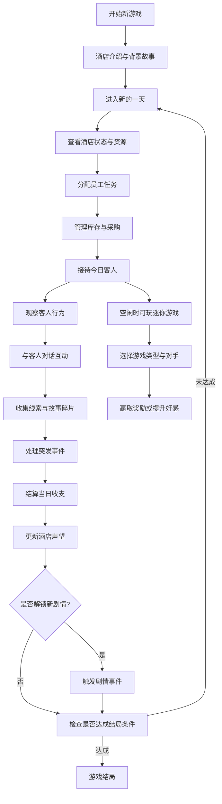

## 1. 产品概述
《百年酒店》是一款像素风格的复古管理叙事游戏，玩家将接手一家没落的百年酒店，通过日常经营管理逐步揭开酒店隐藏的历史谜团。

- **核心玩法**：管理模拟 + 叙事解谜，玩家需平衡酒店运营与客人故事探索
- **目标用户**：喜欢像素风格、模拟经营、叙事解谜游戏的玩家
- **产品价值**：提供沉浸式的复古像素体验，结合策略性经营与情感化叙事

## 2. 核心功能

### 2.1 用户角色
| 角色 | 核心权限 |
|------|----------|
| 玩家 | 酒店经营者，负责人员调度、库存管理、客人接待、故事探索 |

### 2.2 功能模块
1. **酒店总览页**：酒店状态展示、资源面板、快捷操作入口
2. **日常管理页**：员工排班、任务分配、状态监控
3. **库存管理页**：物资采购、消耗追踪、库存预警
4. **客人接待页**：客人信息、需求响应、对话系统
5. **迷你游戏页**：游戏大厅、多种可交互游戏、与员工/客人对战系统
6. **故事档案页**：收集的线索、解锁的故事、历史谜团进度

### 2.3 页面详情
| 页面名称 | 模块名称 | 功能描述 |
|----------|----------|----------|
| 酒店总览 | 资源面板 | 显示金钱、声望、每日收入/支出、酒店评级 |
| 酒店总览 | 酒店状态 | 房间状态、设施状态、今日摘要 |
| 酒店总览 | 快捷操作 | 进入下一天、快速分配、查看提示 |
| 日常管理 | 员工列表 | 显示所有员工状态、技能、体力、心情 |
| 日常管理 | 任务分配 | 将员工分配到不同区域（前台、客房、餐厅、维修） |
| 日常管理 | 区域状态 | 各区域工作进度、服务质量、问题预警 |
| 库存管理 | 物资列表 | 显示所有物资库存、分类筛选 |
| 库存管理 | 采购系统 | 供货商选择、价格对比、批量采购 |
| 库存管理 | 消耗记录 | 物资消耗历史、消耗预测 |
| 客人接待 | 客人列表 | 今日入住客人、客人状态、需求图标 |
| 客人接待 | 客人详情 | 客人背景、特殊需求、对话选项 |
| 客人接待 | 观察系统 | 观察客人行为、发现隐藏线索 |
| 故事档案 | 线索墙 | 已收集线索、关联关系、时间线 |
| 故事档案 | 人物志 | 已解锁客人故事、秘密档案 |
| 故事档案 | 酒店历史 | 酒店历史时间线、重大事件解锁 |
| 迷你游戏 | 游戏大厅 | 游戏列表、分类筛选、玩家统计 |
| 迷你游戏 | 对手选择 | 选择员工/客人作为对手、设置赌注金额 |
| 迷你游戏 | 猜拳对决 | 石头剪刀布对战、三局两胜制 |
| 迷你游戏 | 21点扑克 | 经典21点扑克牌游戏、策略与运气结合 |
| 迷你游戏 | 幸运老虎机 | 三滚轮老虎机、多种符号赔率 |
| 迷你游戏 | 记忆翻牌 | 卡牌记忆配对游戏、与对手轮流对战 |

## 3. 核心流程

**核心流程描述**：
玩家每天按照「分配员工→管理库存→接待客人→收集线索→结算」的循环进行游戏。通过与不同客人的互动，逐渐收集关于酒店历史的线索碎片。当收集到足够的关联线索时，会触发特殊剧情事件，逐步揭开酒店百年历史中的谜团。根据玩家的经营决策和故事选择，最终会导向不同的游戏结局。

## 4. 用户界面设计

### 4.1 设计风格
- **像素艺术风格**：16x16像素网格，复古8-bit/16-bit风格
- **主色调**：深棕色 `#3D2914` 作为主背景，米黄色 `#F5E6D3` 作为主文本色
- **强调色**：酒红色 `#8B2635`（强调/警示）、森林绿 `#2D5A27`（成功/积极）、金色 `#C9A227`（特殊/重要）
- **像素字体**：使用 Press Start 2P 或类似的像素风格字体
- **按钮风格**：像素化边框，2px粗描边，悬停时颜色加深并轻微上移2px
- **布局风格**：复古DOS/Windows 3.1风格窗口，标题栏，边框装饰

### 4.2 页面设计概述
| 页面名称 | 模块名称 | UI元素 |
|----------|----------|--------|
| 酒店总览 | 资源面板 | 像素图标 + 数值，悬停显示详情提示 |
| 酒店总览 | 酒店状态 | 像素化酒店剖面图，各区域用不同颜色标注状态 |
| 日常管理 | 员工列表 | 像素头像卡片，状态条用像素块表示 |
| 日常管理 | 任务分配 | 拖拽式分配，员工图标拖放到区域格子 |
| 库存管理 | 物资列表 | 网格布局，像素物品图标，数量角标 |
| 客人接待 | 客人列表 | 客人像素立绘，状态气泡图标 |
| 客人接待 | 对话系统 | 复古对话框，像素角色头像，选项列表 |
| 故事档案 | 线索墙 | 软木板风格，线索卡片，连线表示关联 |
| 迷你游戏 | 游戏大厅 | 像素风格游戏卡片，显示赔率、难度、可用时段 |
| 迷你游戏 | 对手选择 | 员工/客人标签页切换，赌注滑块，技能条显示 |
| 迷你游戏 | 游戏界面 | 像素化游戏元素，动画效果，实时分数显示 |

### 4.3 动画与交互
- **像素动画**：角色走路、待机、工作循环动画（2-3帧）
- **过渡效果**：场景切换使用像素化溶解/扫描线效果
- **打字机效果**：对话文本逐字显示，可加速跳过
- **闪烁提示**：重要事件用像素闪烁效果提示
- **悬停反馈**：按钮和可交互元素悬停时放大1.1倍，颜色加深

### 4.4 响应式
- **桌面优先**：主游戏区域固定为 960x640 像素画布
- **自适应**：使用CSS缩放保持像素比例，两侧添加复古边框装饰
- **触控优化**：移动端优化点击区域，最小48x48像素

### 4.5 音效设计指南
- **8-bit芯片音乐**：背景音乐使用复古芯片风格
- **像素音效**：点击、对话、事件触发都有对应的8-bit音效
- **氛围音效**：酒店环境音（人声嘈杂、杯盘碰撞、雨声等）
